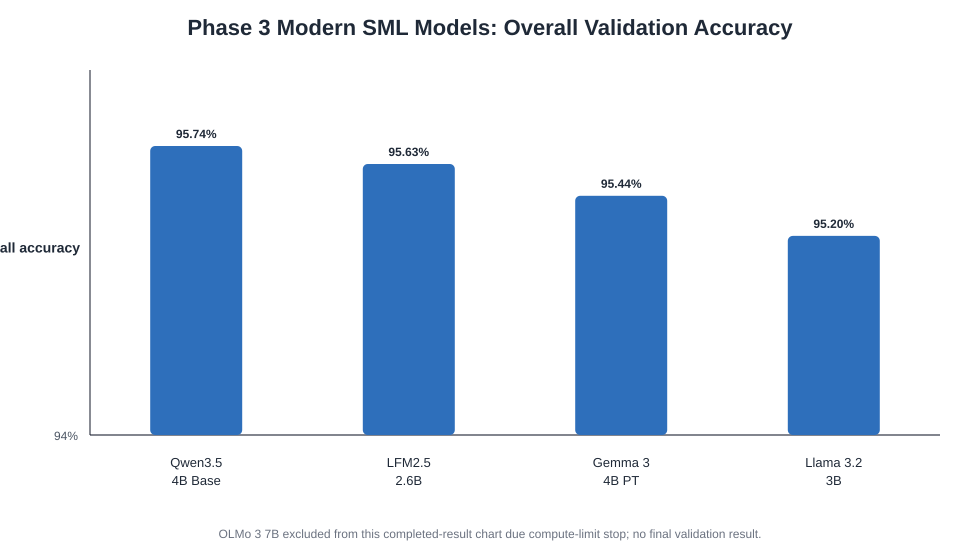
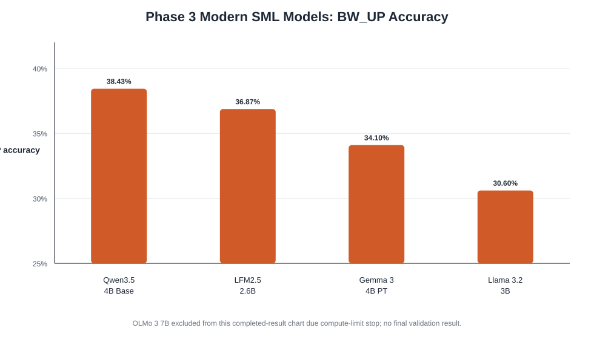
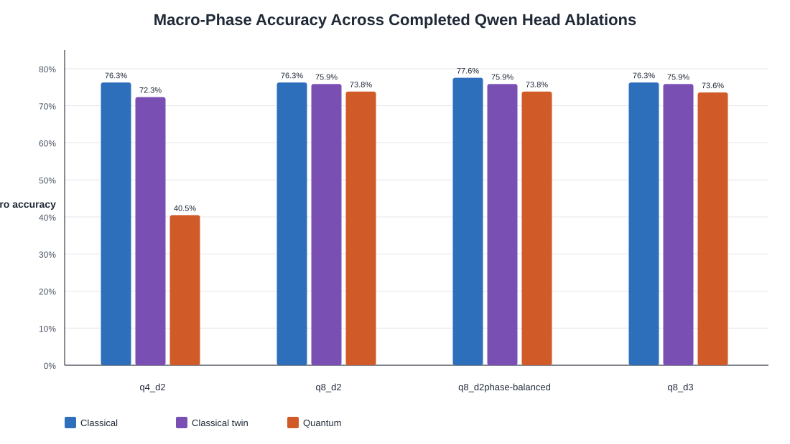
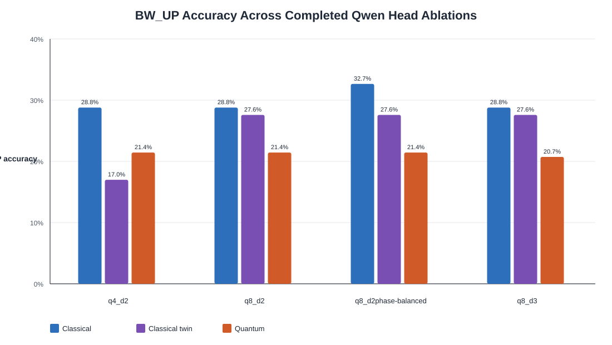
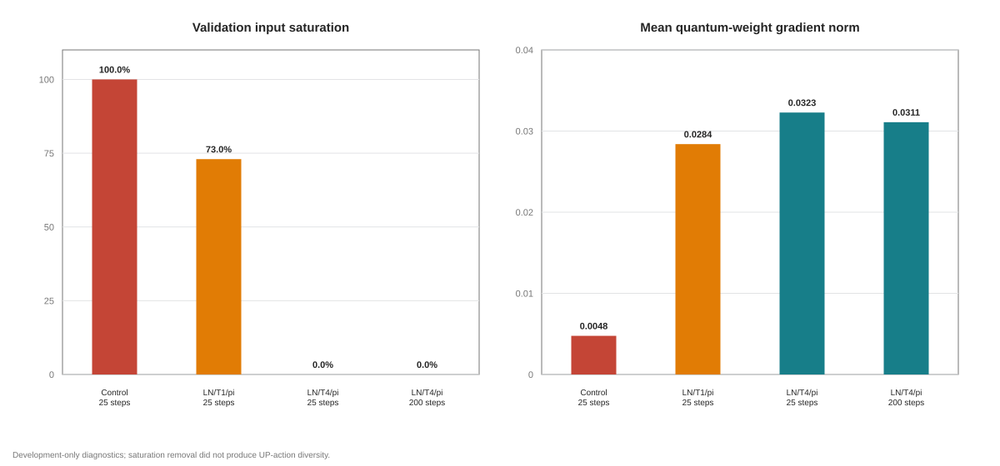
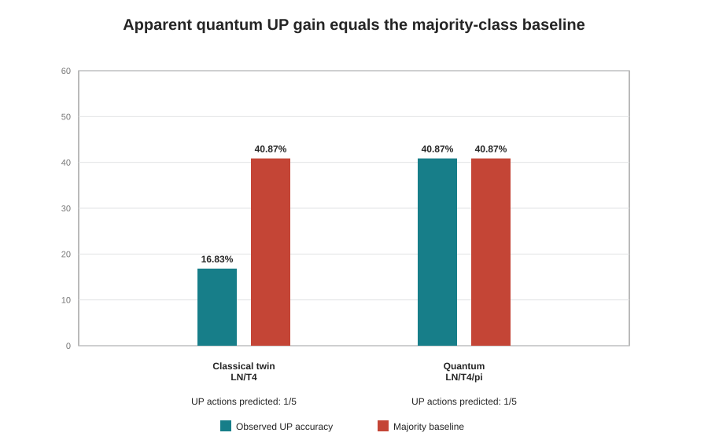
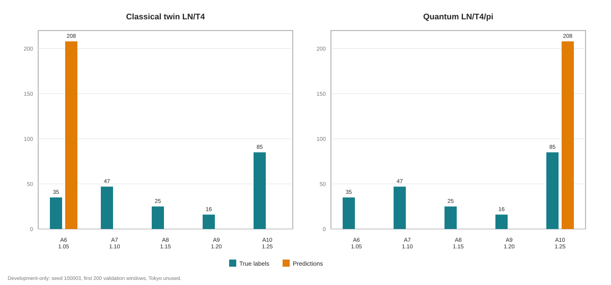

# Quantum-Enhanced Language Model-based Control for BBR over Low Earth Orbit Satellite Internet

> **Manuscript status:** evidence-grounded development draft. The methodology is complete for the implemented pipeline, while the current numerical results are non-Tokyo, single-seed development results. Claims requiring the held-out Tokyo evaluation, multi-seed uncertainty, surrogate network outcomes, or final latency and resource measurements are explicitly deferred rather than inferred.

**Authors:** [Author names and affiliations]

## Abstract

Low Earth Orbit (LEO) satellite Internet exhibits rapid capacity variation, intermittent path changes, and non-terrestrial delay dynamics that complicate transport-layer congestion control. Bottleneck Bandwidth and Round-trip propagation time (BBR) provides high throughput in this environment, but aggressive probing can increase retransmissions and destabilize pacing. Recent work has cast BBR pacing control as offline return-conditioned sequence modelling over structured Starlink telemetry. This paper investigates whether a hybrid quantum-classical action head changes the accuracy, trainability, and generalisation characteristics of a modern language-model controller while preserving the original BBR task. We construct a deterministic experience pool from real iperf3/BBR traces, retain an eleven-action phase-constrained pacing-gain space, and reserve Tokyo exclusively for final held-out evaluation. Four downloadable language models are first compared under a shared LoRA protocol. Qwen3.5-4B-Base achieves the strongest one-seed development result, with 95.74% overall action accuracy, 79.48% macro-phase accuracy, and 38.43% ProbeBW_UP accuracy. We then attach three heads to the same Qwen backbone: a linear classical head, an eight-dimensional classical bottleneck, and an eight-qubit Qiskit EstimatorQNN head. Increasing the quantum head from four to eight qubits repairs an initial ProbeBW_DOWN failure, but the eight-qubit model remains weaker than the classical head on ProbeBW_UP. Neither phase-balanced loss, an additional variational layer, added RZ rotations, nor balanced-UP replacement sampling resolves the collapse of bottleneck predictions to a single UP action. Layer normalization and temperature scaling remove measured quantum input saturation and preserve finite circuit gradients, yet a 200-step diagnostic still predicts the UP majority class exclusively. These results do not establish quantum advantage; instead, they show that optimization connectivity alone is insufficient and identify representation separability across the bottleneck as the next controlled research question. Final claims are withheld pending predefined multi-seed training and one-time Tokyo evaluation.

**Index Terms:** BBR, congestion control, Low Earth Orbit satellite Internet, Starlink, language models, Low-Rank Adaptation, quantum machine learning, variational quantum circuits.

## I. Introduction

LEO satellite constellations provide broadband coverage with lower propagation delay than geostationary systems, but their moving topology, handovers, variable link capacity, and weather- and load-dependent channel conditions create a difficult operating environment for transport protocols. BBR differs from loss-based congestion-control algorithms by estimating bottleneck bandwidth and propagation delay and using these estimates to regulate pacing and the volume of in-flight data. Measurements over Starlink show that this model-based behavior can preserve high throughput, although bandwidth probing may also increase retransmissions and queue pressure [1], [2].

Learning-based congestion control offers a way to map observed network state directly to control decisions. The SLM-BBR framework reformulates pacing-gain selection as offline, return-conditioned sequence modelling over real Starlink telemetry [1]. It combines a structured state encoder, a pretrained language-model backbone, Low-Rank Adaptation (LoRA), and a constrained task head that emits one valid BBR pacing action per decision step. This design avoids free-form text generation and provides an explicit safety constraint through a phase-dependent action mask.

The present study asks a narrower and causal question: **when the data, backbone, tuning policy, and evaluation path are held fixed, does replacing the classical action head with a trainable variational quantum circuit improve the controller's accuracy-efficiency-generalisation trade-off?** Quantum learning has recently been investigated for satellite resource allocation, often through variational quantum circuits (VQCs) trained in hybrid classical-quantum systems [3]. However, that prior task concerns beam and power allocation rather than TCP congestion control. We therefore use it only as architectural motivation and do not replace the SLM-BBR state, action, reward, or evaluation formulation.

This paper makes four contributions:

1. It specifies a deterministic and auditable reproduction of the SLM-BBR experience-pool construction, including phase detection, eleven phase-safe pacing gains, stable sample identifiers, trace-level development splitting, and strict isolation of Tokyo.
2. It benchmarks four recent downloadable language models under one shared LoRA and evaluation protocol, identifying Qwen3.5-4B-Base as the current GPT-style development candidate without using the held-out location.
3. It implements a Qiskit-backed Quantum-GPT head and compares it with both the normal classical head and an eight-dimensional classical bottleneck control attached to the same Qwen hidden representation.
4. It reports negative and diagnostic evidence as first-class results: the quantum head is differentiable and trainable, but current VQC variants lose ProbeBW_UP class discrimination. Saturation correction improves gradient conditions without resolving this collapse.

The model-performance evidence currently reported here is limited to
development data. The frozen Tokyo pool has been generated, but no Tokyo model-
inference result has yet been incorporated. No claim of unseen-location
generalisation or quantum advantage is made before the frozen evaluation and
audited manifest are available.

## II. Background and Related Work

### A. BBR over Starlink

BBR regulates sending behavior using an explicit model of bottleneck bandwidth and round-trip propagation time. Experimental studies over geographically distributed Starlink paths show that BBR can outperform Cubic, Vegas, and Hybla in throughput, while its active probing produces a trade-off involving retransmissions and stability [1], [2]. These observations motivate finer control over the fixed ProbeBW pacing cycle rather than wholesale replacement of BBR.

### B. Language Models for Network Control

Transformer policies can model long-range temporal dependence and cross-feature interactions in network telemetry. Prior work has adapted language models to active queue management through structured encoders, task-specific action heads, and parameter-efficient tuning [4]. SLM-BBR applies the same broad design pattern to BBR pacing over Starlink: telemetry is embedded as a return-state-action sequence, the language-model backbone supplies contextual representations, and a constrained head maps those representations directly to pacing actions [1]. The direct head avoids token-by-token text generation and prevents unconstrained or hallucinated actions.

### C. Variational Quantum Models

VQCs encode classical features into parameterized quantum gates, apply trainable rotations and entangling operations, and expose measured expectation values to a classical optimizer. Hybrid quantum reinforcement-learning systems have been proposed for satellite resource allocation, with most current evidence obtained using simulated quantum backends [3]. The proposed Quantum-GPT differs in three important ways: it addresses offline BBR action prediction rather than continuous beam/power allocation; it places the quantum component only in the task head; and it compares the VQC against the same GPT parent and a matched low-dimensional classical bottleneck. This design isolates the effect of the quantum transformation more directly than a comparison between unrelated end-to-end models.

## III. Problem Formulation

### A. Offline Return-Conditioned Control

Each Starlink trace is represented as an episode of per-interval observations. At interval \(i\), the state is

\[
s_i = [L_i, S_i, t_i, b_i, \tau_i, cwnd_i, rwnd_i, RTT_i, RTTvar_i],
\]

where \(L_i\) is a location identifier, \(S_i\) is a stream-scenario identifier, \(t_i\) is time, \(b_i\) is throughput, \(\tau_i\) is retransmissions, and the remaining terms are the congestion window, receiver window, round-trip time, and RTT variance. The learning objective is to predict one expert pacing-gain action at every sequence position from a temporally ordered return-state-action context.

Let \(r_i\) denote the reward assigned to the selected expert action. The return-to-go is

\[
R_i = \sum_{j=i}^{T} \gamma^{j-i} r_j,
\]

with \(\gamma=1\) in the implemented development pipeline and a fixed return scale of 10. Complete windows of length 20 are sampled within trace boundaries; no window may cross an episode boundary.

### B. Phase-Safe Action Space

The global action set contains exactly eleven discrete BBR pacing gains:

\[
\mathcal{A}=\{0.90,0.92,0.94,0.96,0.98,1.00,1.05,1.10,1.15,1.20,1.25\}.
\]

The feasible subset depends on the detected BBR macro-phase:

\[
\mathcal{A}_{\phi_i}=\begin{cases}
\{0.90,0.92,0.94,0.96,0.98\}, & \phi_i=\mathrm{BW\_DOWN},\\
\{1.00\}, & \phi_i=\mathrm{BW\_CRUISE},\\
\{1.05,1.10,1.15,1.20,1.25\}, & \phi_i=\mathrm{BW\_UP}.
\end{cases}
\]

For logits \(z_i\in\mathbb{R}^{11}\), invalid entries are replaced by \(-\infty\) before both loss evaluation and action selection. The prediction is therefore

\[
\hat a_i=\arg\max_{a\in\mathcal{A}_{\phi_i}} z_{i,a}.
\]

The phase mask is a safety invariant shared by every model; the task is not treated as unconstrained classification or text generation.

## IV. Methodology

### A. Starlink Dataset and Trace Groups

The raw source consists of iperf3 BBR captures from six remote endpoints: Ohio, Sao Paulo, London, Mumbai, Sydney, and Tokyo. Each location contains four traffic groups: sequential downlink, sequential uplink, competitive downlink, and competitive uplink. Every interval contributes sender-side throughput, retransmissions, congestion window, receiver window, RTT, and RTT variance. Raw captures are immutable; all labels, split files, and sequence samples are deterministically derived and versioned.

Ohio, Sao Paulo, London, Mumbai, and Sydney form the development domain. Tokyo is reserved for a single final unseen-location evaluation and is excluded from preprocessing statistics, training, validation, checkpoint selection, architecture choice, hyperparameter selection, and model ranking.

### B. Phase Detection

Let \(\bar b_i\) be the centered rolling mean of throughput with half-window \(w=10\), and define

\[
d_i=b_i-\bar b_i, \qquad \sigma_d=\operatorname{std}(d).
\]

A sample is marked as an UP event when \(d_i>0.7\sigma_d\) and it is a local maximum. After an UP event, the first subsequent local minimum satisfying \(d_i<-0.7\sigma_d\) is marked DOWN. The next six samples are assigned CRUISE, consistent with the macro-structure used by the source method. All remaining positions are CRUISE. Detection is performed independently within each raw trace.

### C. Expert Action and Reward Construction

For each trace, define a throughput-utilization proxy using the trace maximum,

\[
\bar B_i=\frac{b_i}{\max_j b_j}.
\]

The continuous target gain follows the source formulation:

\[
G_i^{\uparrow}=\frac{3}{\bar B_i+2}, \qquad
G_i^{\downarrow}=\frac{\bar B_i+1}{2}.
\]

The expert action is the nearest discrete gain within the detected phase's feasible set; CRUISE is fixed to 1.00. Ties are resolved deterministically by the lower action index. This Equation 2-3 construction is the authoritative label path used by the experiments. It is important to state this explicitly because a literal independent maximization of the surrogate reward over every candidate action produced a different, collapsed exploratory label set.

Reward assignment follows the source hybrid utilization model. The rolling throughput and retransmission references are

\[
B_i^{ref}=Q_{0.95}(b_{i-w:i+w}), \qquad
\tau_i^{ref}=Q_{0.95}(\tau_{i-w:i+w})+1.
\]

With \(RTT_{min,i}=\min(RTT_{i-w:i+w})\), queue delay \(qd_i=\max(RTT_i-RTT_{min,i},0)\), and

\[
q_i^{ref}=\min\left(Q_{0.95}(qd_{i-w:i+w}),0.15RTT_{min,i}\right),
\]

the rate, delay, and hybrid utilization terms are

\[
U_i^{rate}=\min\left(\frac{b_i}{B_i^{ref}},1\right),\quad
U_i^{delay}=\min\left(\frac{qd_i}{q_i^{ref}},1\right),\quad
U_i=\max(U_i^{rate},U_i^{delay}).
\]

For gain \(g\), the probe strength and normalized probe component are

\[
S(g)=\max(\operatorname{softplus}(\beta(g-1))-\operatorname{softplus}(0),0),
\]

\[
\Phi(g)=\left(\frac{S(g)}{S(g_{max})}\right)^{\alpha},
\]

where \(\alpha=1.5\), \(\beta=5\), and \(\epsilon=10^{-3}\). The instantaneous loss factor is

\[
L_i(g)=U_i[\epsilon+(1-\epsilon)\Phi(g)].
\]

For \(g<1\), it is reduced by \(1-\kappa_{down}(1-g)\), where \(\kappa_{down}=0.5\), and then clipped to \([0,1]\). Predicted retransmissions use the local envelope

\[
\hat\tau_i(g)=\tau_{min}+(\tau_{max,i}-\tau_{min})L_i(g).
\]

The reward stored for the selected expert action is

\[
r_i=\min(g,1)-\lambda_1\frac{\hat\tau_i(g)}{\tau_i^{ref}}
-\lambda_2U_i\max(g-1,0),
\]

with \(\lambda_1=0.5\) and \(\lambda_2=0.1\).

The resulting non-Tokyo experience pool contains 60,084 samples from 200 traces: 52,576 CRUISE (87.50%), 3,292 DOWN (5.48%), and 4,216 UP (7.02%). All five UP actions occur. All DOWN targets map to gain 0.90 because their continuous targets fall below the 0.91 nearest-action boundary. This empirical label collapse is retained rather than altered model-by-model.

### D. Development Split and Sequence Sampling

The five-location pool is divided at the trace level using a deterministic SHA-256 ranking with seed 100003. Within every location-by-stream stratum, two of ten traces are held out for validation. This produces 160 training traces with 48,065 samples and 40 validation traces with 12,019 samples. The sample-ID sets are disjoint, and windows are constructed only within their originating traces.

For the main modern-model benchmark, non-overlapping windows of length 20 are sampled with step 20, yielding 2,400 training windows and 600 validation windows. The complete validation pool contains 10,476 CRUISE, 713 DOWN, and 830 UP samples; the 600 full windows used for evaluation contain 10,457 CRUISE, 713 DOWN, and 830 UP positions, with 19 trailing CRUISE samples excluded because they do not form a complete within-trace window. Because CRUISE accounts for approximately 87.14% of evaluated positions and has only one feasible action, overall accuracy is treated as a secondary metric rather than the sole ranking criterion.

### E. Structured Transformer Policy

Each scalar state feature is independently projected from one dimension to a 256-dimensional representation using a fully connected layer and LeakyReLU. Nine model-specific linear mappings then align these state features to the backbone hidden size. Return and normalized previous-action values are also linearly embedded, and a learned timestep embedding is added.

At time \(i\), the ordered token block is

\[
x_i=[E_R(R_i),E_{s_1}(s_i^{(1)}),\ldots,E_{s_9}(s_i^{(9)}),E_a(a_i)].
\]

Twenty decision steps therefore produce 220 structured embeddings. Layer normalization is applied before the embeddings are supplied through the backbone's `inputs_embeds` interface. The final hidden representation after the ninth state token, immediately before the previous-action token, is used to predict the action at that timestep. The standard language-model vocabulary head is not used.

### F. Modern Backbones and LoRA

The development benchmark evaluates four completed downloadable models:

| Model | Pinned revision | Training dtype |
|---|---|---:|
| Qwen3.5-4B-Base | `1001bb4d826a52d1f399e183466143f4da7b741b` | BF16 |
| LFM2.5-2.6B | `a4e00e83c0979ee9deb88d04b6360599fa956656` | FP16 |
| Gemma 3-4B PT | `cc012e0a6d0787b4adcc0fa2c4da74402494554d` | BF16 |
| Llama 3.2-3B | `13afe5124825b4f3751f836b40dafda64c1ed062` | FP16 |

OLMo 3-7B was screened but excluded after a partial run projected 29-33 days for the shared five-epoch protocol on the available hardware. Its partial loss is not compared with completed models.

LoRA is attached to architecture-appropriate attention or sequence-mixing projections while the remaining backbone parameters are frozen. The shared development configuration uses rank 8, scaling factor 32, dropout 0.05, AdamW with learning rate \(10^{-4}\) and weight decay \(10^{-4}\), batch size 1, gradient accumulation over 32 sequences, gradient clipping at 0.25, five epochs, sequence length 20, and seed 100003. Family-specific LoRA target modules are declared in each run manifest; data, labels, masks, optimization budget, and evaluation records remain common.

### G. Classical, Classical-Twin, and Quantum Heads

After selecting Qwen as the current GPT-style development parent, we compare three heads at the same hidden-state extraction point.

The normal classical head is

\[
z_i=W_ch_i+b_c, \qquad W_c\in\mathbb{R}^{11\times d}.
\]

The classical twin introduces an eight-dimensional bottleneck:

\[
u_i=\tanh(W_ph_i+b_p), \qquad z_i=W_ou_i+b_o.
\]

The quantum head first projects the same hidden state to \(n_q\) values and bounds them as rotation angles:

\[
p_i=W_qh_i+b_q, \qquad x_i=\pi\tanh(p_i/T).
\]

Unless stated otherwise, \(T=1\). Each component \(x_{i,k}\) is encoded by an \(R_Y(x_{i,k})\) gate. A depth-\(D\) variational circuit applies trainable \(R_Y(\theta_{d,k})\) rotations followed by a CNOT ring. Per-qubit Pauli-Z expectation values form \(q_i\in[-1,1]^{n_q}\), and a final linear layer maps them to eleven logits:

\[
q_{i,k}=\langle Z_k\rangle, \qquad z_i=W_{out}q_i+b_{out}.
\]

The circuit is implemented using Qiskit Machine Learning 0.9.0 `EstimatorQNN` and `TorchConnector`, with Qiskit 2.5.1 `StatevectorEstimator`, analytic expectation values (`default_precision=0.0`), and no finite shots or quantum hardware. Qiskit tensors execute on CPU while the language-model path executes on Apple MPS; transfers remain in the autograd graph. The principal diagnostic circuit uses eight qubits, depth two, and 16 trainable circuit angles. The classical twin has the same eight-dimensional information bottleneck, while total trainable parameters remain nearly matched: 10,999,915 for the twin and 10,999,931 for the quantum variant in the CRUISE-80 runs.

### H. Training Objective

Let \(y_i\) be the expert action index. Invalid phase logits are masked and the unweighted training objective is

\[
\mathcal{L}=-\frac{1}{N}\sum_{i=1}^{N}\log
\frac{\exp z_{i,y_i}}{\sum_{a\in\mathcal{A}_{\phi_i}}\exp z_{i,a}}.
\]

A named phase-balanced ablation assigns equal total loss weight to each phase present in a batch. Validation loss and every reported validation accuracy remain unweighted. No model receives a private label, mask, preprocessing path, or validation distribution.

### I. Controlled Diagnostics

Four controlled studies investigate the observed UP failure:

1. **Circuit capacity:** four versus eight qubits, and depth two versus depth three.
2. **Ansatz:** trainable RY layers versus matched RY+RZ layers.
3. **Training distribution:** a shared 2,400-window CRUISE-80 design applied to all three heads. It retains 800 high-UP-context windows and draws 1,600 replacement windows, producing 79.365% CRUISE, 14.246% UP, and 6.390% DOWN positions. Each development location contributes 480 windows, and UP action counts are nearly balanced. The unchanged natural validation set is used for evaluation.
4. **Saturation and trainability:** optional LayerNorm before the bottleneck, a fixed pre-tanh temperature \(T\in\{1,4\}\), and a quantum angle range of \(\pi\) or \(\pi/2\). Diagnostics record projection magnitude, bounded-feature variance, saturation ratio \(\Pr(|\tanh(p/T)|>0.99)\), and component-wise gradient norms.

All diagnostics use seed 100003 and non-Tokyo validation data. They are architecture and optimization probes, not final model-ranking experiments.

### J. Metrics and Reproducibility

We report phase-masked cross-entropy loss, overall action accuracy, per-phase accuracy, and macro-phase accuracy:

\[
Acc_{macro}=\frac{1}{3}\sum_{\phi\in\{DOWN,CRUISE,UP\}}Acc_{\phi}.
\]

Per-action label and prediction distributions are mandatory because an apparently high UP accuracy may equal a single-class frequency. Run manifests record the dataset and split versions, hashes of pools and sample IDs, model identifier and revision, seed, LoRA configuration, head configuration, quantum backend, optimizer, hardware, software versions, checkpoint path, and wall-clock time. Every completed run included here passed checkpoint reload and Tokyo-isolation audits.

The final evaluation protocol additionally requires mean, standard deviation, and per-seed results; throughput and retransmission outcomes from the common surrogate models; inference latency; parameter counts; memory use; training time; and a single held-out Tokyo evaluation after all decisions are frozen. Those outcomes are not yet available and are not extrapolated from development accuracy.

## V. Experimental Results

### A. Modern Language-Model Benchmark

Table I reports the shared five-epoch, one-seed development benchmark.

**Table I. Modern-model results on the non-Tokyo validation split.**

| Model | Overall accuracy | UP accuracy | Macro-phase accuracy | Validation loss |
|---|---:|---:|---:|---:|
| Qwen3.5-4B-Base | **95.74%** | **38.43%** | **79.48%** | **0.09531** |
| LFM2.5-2.6B | 95.63% | 36.87% | 78.96% | 0.10110 |
| Gemma 3-4B PT | 95.44% | 34.10% | 78.03% | 0.10653 |
| Llama 3.2-3B | 95.20% | 30.60% | 76.87% | 0.11112 |

All four models achieve 100% accuracy on DOWN and CRUISE. Their differences arise entirely from UP, the only phase in this dataset with both multiple observed labels and substantial prediction difficulty. Qwen leads all four listed development metrics and is therefore the current eligible GPT-style parent. The margin is small and based on one seed, so the result supports candidate selection for controlled diagnostics rather than a final superiority claim.

### B. Quantum-Head Capacity and Ansatz Ablations

Table II compares the same Qwen parent with classical, classical-twin, and quantum heads under one-epoch development pilots.

**Table II. Qwen head-ablation results on the non-Tokyo validation split.**

| Configuration | Head | Overall | Macro-phase | DOWN | CRUISE | UP |
|---|---|---:|---:|---:|---:|---:|
| q4, depth 2 | Classical | 95.08% | 76.27% | 100.00% | 100.00% | 28.80% |
| q4, depth 2 | Classical twin | 94.26% | 72.33% | 100.00% | 100.00% | 16.99% |
| q4, depth 2 | Quantum | 88.62% | 40.48% | 0.00% | 100.00% | 21.45% |
| q8, depth 2 | Classical | 95.08% | 76.27% | 100.00% | 100.00% | 28.80% |
| q8, depth 2 | Classical twin | 94.99% | 75.86% | 100.00% | 100.00% | 27.59% |
| q8, depth 2 | Quantum | 94.57% | 73.82% | 100.00% | 100.00% | 21.45% |
| q8, depth 2, phase-balanced | Classical | 95.34% | 77.55% | 100.00% | 100.00% | 32.65% |
| q8, depth 2, phase-balanced | Classical twin | 94.99% | 75.86% | 100.00% | 100.00% | 27.59% |
| q8, depth 2, phase-balanced | Quantum | 94.57% | 73.82% | 100.00% | 100.00% | 21.45% |
| q8, depth 3 | Quantum | 94.52% | 73.57% | 100.00% | 100.00% | 20.72% |
| q8, depth 2, RY+RZ | Quantum | 94.57% | 73.82% | 100.00% | 100.00% | 21.45% |

The four-qubit quantum head is technically functional but predicts the wrong valid DOWN class for every validation DOWN position. Expanding to eight qubits repairs this failure, increasing DOWN accuracy from 0% to 100% and overall accuracy from 88.62% to 94.57%. The improvement does not extend to UP: the eight-qubit quantum head predicts action 8 (gain 1.15) for every UP position and reaches only 21.45% UP accuracy.

Phase-balanced loss improves the normal classical head's UP accuracy from 28.80% to 32.65%, but leaves the quantum result unchanged. Increasing depth from two to three slightly reduces quantum UP accuracy to 20.72%. Adding trainable RZ gates doubles the q8/depth-2 circuit parameters from 16 to 32 without changing UP accuracy or the collapse pattern. Thus, neither additional depth nor the tested increase in single-qubit expressivity addresses the current bottleneck.

### C. Balanced-UP Sampling

The CRUISE-80 design increases the UP share of training positions from approximately 7.05% to 14.25% and nearly balances actions 6-10, while applying the identical sampled indices to all heads. Table III shows evaluation on the unchanged 600-window natural validation set.

**Table III. CRUISE-80 fair head comparison.**

| Head | Overall accuracy | Macro-phase accuracy | DOWN | CRUISE | UP |
|---|---:|---:|---:|---:|---:|
| Classical | **94.87%** | **75.26%** | 100% | 100% | **25.78%** |
| Classical twin | 94.26% | 72.33% | 100% | 100% | 16.99% |
| Quantum q8/depth-2 RY | 94.26% | 72.33% | 100% | 100% | 16.99% |

Both bottleneck heads predict action 7 (gain 1.10) for all 830 validation UP positions. The classical head produces predictions across all five UP actions, although its 25.78% UP accuracy remains weak. Relative to the original-distribution q8/depth-2 pilots, CRUISE-80 reduces UP accuracy for classical, twin, and quantum heads. The design contains only 835 unique windows and 1,565 repeated selections, making replacement-driven overfitting a plausible risk, but one seed is insufficient to identify the cause. The experiment shows that balancing marginal UP action counts in the training sampler does not by itself create natural-validation discrimination.

### D. Saturation and Gradient Diagnostics

Short trainability diagnostics reveal severe bounded-encoding saturation in both low-dimensional heads. In their original form, the classical twin exhibits approximately 88% validation tanh saturation and the quantum head reaches 100% validation angle saturation. Quantum circuit gradients remain finite and non-zero, indicating that the Qiskit layer is connected to the optimization graph.

Adding head-input LayerNorm and temperature \(T=4\) reduces measured validation saturation to 0% in the initial 25-step quantum and classical-twin diagnostics. For the quantum head, the mean circuit-gradient norm rises from 0.00476 in the saturated control to 0.03228 with LayerNorm/T4/\(\pi\). Reducing the angle range to \(\pi/2\) provides no early improvement and yields a smaller mean circuit-gradient norm of 0.02365. Despite the improved conditioning, each quantum configuration still predicts a single UP action in the 37-position validation slice.

The 200-step gate confirms that longer optimization under the normalized configuration does not resolve collapse. The quantum head retains 0% measured validation saturation and a finite mean circuit-gradient norm of 0.03109, but predicts action 10 for all 208 UP positions. Its apparent 40.87% UP accuracy is exactly \(85/208\), the frequency of action-10 labels in that slice. The classical twin predicts action 6 for all 208 UP positions and reaches 16.83%, exactly \(35/208\). Its validation saturation also rises to 50.27% as the mean absolute raw projection grows to 11.19. These scores represent majority-class matching, not learned separation among UP actions.

## VI. Discussion

### A. What the Current Evidence Supports

The first robust observation is that model selection cannot rely on overall accuracy. A model that always chooses the only CRUISE action and the single observed DOWN label already solves most validation positions. Macro-phase accuracy, UP accuracy, and prediction diversity are therefore necessary to expose meaningful control behavior.

Second, the quantum path is operational rather than disconnected. It produces valid phase-masked logits, survives forward/backward training and checkpoint reload, and receives finite gradients through Qiskit's `TorchConnector`. Increasing the representation from four to eight qubits also changes behavior materially by repairing the DOWN failure.

Third, the current evidence does not support quantum advantage. The normal classical Qwen head retains more UP discrimination and exceeds the tested quantum configurations on macro-phase and UP accuracy. The parameter-light classical twin often exhibits the same failure as the quantum head, suggesting that low-dimensional compression is a shared confounder. This makes the twin essential: without it, the collapse could be incorrectly attributed to quantum dynamics alone.

### B. Why Saturation Is Not a Complete Explanation

The initial \(\pi\tanh(\cdot)\) encoding compresses large projection magnitudes near the extrema, where different hidden states can map to nearly identical angles. Layer normalization and temperature scaling substantially improve this condition and increase the measured quantum gradient signal. Nevertheless, prediction diversity does not emerge after 200 steps. The failure therefore cannot be explained solely by vanishing gradients or disconnected optimization.

The next discriminating test is representation separability. UP-class information should be measured at four stages: the Qwen hidden state, the raw eight-dimensional projection, the bounded classical feature or quantum expectation vector, and the final UP logits. If classes are already inseparable at the Qwen hidden state, the problem precedes the head. If separation is present before compression but disappears afterward, the bottleneck dimension or geometry is implicated. If quantum expectations uniquely erase otherwise separable projected classes, the encoding, observable set, or circuit architecture becomes the next controlled target.

### C. Implications for Quantum-Enhanced Network Control

Hybrid quantum models should be evaluated against both a full classical head and a capacity-matched classical bottleneck. A favorable comparison against only the latter would not demonstrate that a quantum layer improves the practical controller; conversely, a shared failure of both bottlenecks indicates a compression problem that circuit expansion alone may not solve. The present results also show why apparent accuracy gains must be checked against label frequencies and prediction distributions. The 40.87% quantum UP score in the 200-step gate appears promising until its all-action-10 predictions are examined.

### D. Limitations and Threats to Validity

The current results have five principal limitations.

1. **Development-only evidence:** Tokyo has not been evaluated. Unseen-location generalisation remains unknown.
2. **Single-seed comparisons:** the reported benchmark and head ablations use seed 100003. Variance and statistical uncertainty are not yet available.
3. **Exploratory split status:** the deterministic 80/20 development split is implemented and audited but remains marked as pending final supervisor approval.
4. **Class imbalance and label degeneracy:** CRUISE dominates the data, and every DOWN label maps to 0.90 under the approved Equation 2-3 rule. DOWN accuracy therefore does not measure five-way discrimination.
5. **Simulator-only quantum execution:** all quantum results use an analytic local statevector estimator with no shot noise or hardware errors. They do not establish feasibility or performance on physical quantum hardware.

Further limitations include the OLMo compute exclusion, incomplete multi-seed confirmation of the Qwen parent, absence of final surrogate throughput/retransmission results for the new models, and lack of final inference latency and memory measurements. These missing outcomes prevent a complete claim about the accuracy-efficiency-generalisation trade-off.

## VII. Final Evaluation Protocol

Before submission, the following protocol should be frozen in a committed configuration and executed without further Tokyo-informed changes:

1. Approve the trace-stratified development split and the primary checkpoint-selection rule.
2. Complete the predefined seeds 100003, 100019, and 100043 for the selected classical baselines and the final same-Qwen head variants.
3. Complete the UP separability analysis using development validation records only, then either retain the current q8/depth-2 model or declare one final architecture change through a named ablation.
4. Freeze preprocessing, sampling, labels, masks, model revisions, LoRA targets, optimization budgets, and checkpoints.
5. Evaluate each frozen model once on the Tokyo pool using identical sample IDs and metrics.
6. Report mean, standard deviation, and per-seed development results; Tokyo action loss/accuracy; macro-phase and per-action behavior; surrogate throughput and retransmissions; inference latency; trainable parameters; memory; wall-clock training time; and quantum circuit evaluations.
7. Base any quantum claim on the comparison with both the identical-backbone classical head and the classical bottleneck twin. If the quantum model does not exceed these controls with uncertainty considered, report the result as a negative finding rather than quantum advantage.

## VIII. Conclusion

This work extends language-model-based BBR pacing control with a Qiskit-backed variational quantum action head while preserving the original eleven-action task, phase mask, data pipeline, and held-out-location protocol. Qwen3.5-4B-Base is the strongest model in the current one-seed modern-backbone development benchmark. An eight-qubit quantum head repairs the DOWN collapse observed with four qubits, but remains less discriminative than the normal classical head on UP actions. Controlled experiments show that phase balancing, additional circuit depth, RY+RZ rotations, and balanced-UP replacement sampling do not resolve the failure. Layer normalization and temperature scaling remove measured saturation and retain finite circuit gradients, yet both quantum and classical bottleneck heads still collapse to a single UP action after 200 steps. The present evidence therefore supports a diagnosis of representation loss, not a claim of quantum advantage. A stage-wise separability analysis, predefined multi-seed confirmation, and frozen Tokyo inference are required to determine whether the hybrid quantum head can improve unseen-location BBR control; Quantum-GPT design choices must not use the already generated Tokyo pool or its later model results.

## References

[1] R. De Silva, S. R. Pokhrel, and J. Kua, “Small Language Model-based Control for BBR over Low Earth Orbit Satellite Internet,” arXiv:2607.07142v1, 2026.

[2] R. De Silva, S. R. Pokhrel, and J. Kua, “Unveiling TCP BBR Dominance in Starlink Internet: Experimental Insights and Analysis,” arXiv:2607.07133v1, 2026.

[3] Q. T. Ngo, Y. He, B. Jayawickrama, E. Dutkiewicz, and S. R. Pokhrel, “Quantum Reinforcement Learning With Classical Policy Deployment for Resource Allocation in Multibeam GEO-LEO Satellite Networks,” *IEEE Internet of Things Journal*, vol. 13, no. 9, 2026, doi:10.1109/JIOT.2026.3663363.

[4] S. R. Pokhrel, D. Satish, J. Kua, and A. Walid, “Distilling Large Language Models for Network Active Queue Management,” *IEEE Transactions on Networking*, vol. 34, 2026, doi:10.1109/TON.2026.3690076.

[5] N. Cardwell, I. Swett, and J. Beshay, “BBR Congestion Control,” IETF Congestion Control Working Group, Internet-Draft draft-ietf-ccwg-bbr-03, 2024.

[6] D. Wu, X. Wang, Y. Qiao, Z. Wang, J. Jiang, S. Cui, and F. Wang, “NetLLM: Adapting Large Language Models for Networking,” in *Proceedings of ACM SIGCOMM*, 2024, pp. 661-678, doi:10.1145/3651890.3672268.

[7] L. Xu et al., “Parameter-efficient Fine-tuning Methods for Pretrained Language Models: A Critical Review and Assessment,” *Nature Machine Intelligence*, 2023.

## Appendix A. Evidence-to-Claim Boundary

| Claim | Current status | Evidence required for final wording |
|---|---|---|
| Qwen is the leading development backbone | Supported for one seed | Multi-seed confirmation |
| Quantum q8 fixes q4 DOWN failure | Supported on development validation | Seed replication |
| Quantum improves UP discrimination | Not supported | Diverse predictions and superiority to both controls |
| Quantum advantage | Not supported | Multi-seed same-parent improvement with uncertainty |
| Unseen-location generalisation | Unknown | Frozen Tokyo evaluation |
| Network throughput/retransmission benefit | Unknown for the new models | Shared surrogate or TCP-in-the-loop evaluation |
| Deployment efficiency | Unknown | Final latency, memory, parameter, and runtime measurements |

## Appendix B. Reproducibility Snapshot

| Item | Current value |
|---|---|
| Dataset version | `slm-bbr-paper-w10-eq2-3-labels-v1-exploratory` |
| Split version | `dev-trace-stratified-80-20-seed-100003-v1-exploratory` |
| Development locations | Ohio, Sao Paulo, London, Mumbai, Sydney |
| Held-out location | Tokyo |
| Primary development seed | `100003` |
| Planned seed set | `100003`, `100019`, `100043` |
| Sequence length / step | 20 / 20 |
| Optimizer | AdamW |
| Learning rate / weight decay | `1e-4` / `1e-4` |
| LoRA rank / alpha / dropout | 8 / 32 / 0.05 |
| Quantum software | Qiskit 2.5.1; Qiskit Machine Learning 0.9.0 |
| Quantum backend | local analytic `StatevectorEstimator`, no shots |
| Principal VQC | 8 qubits, depth 2, RY encoding, trainable RY layers, CNOT ring, per-qubit Z measurements |
