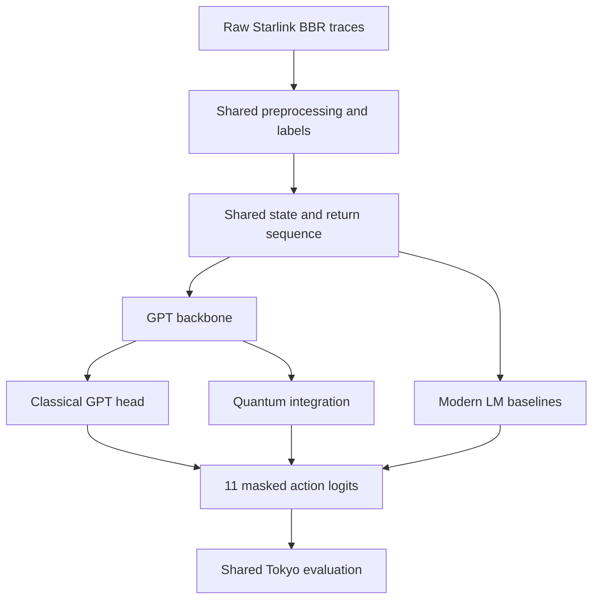
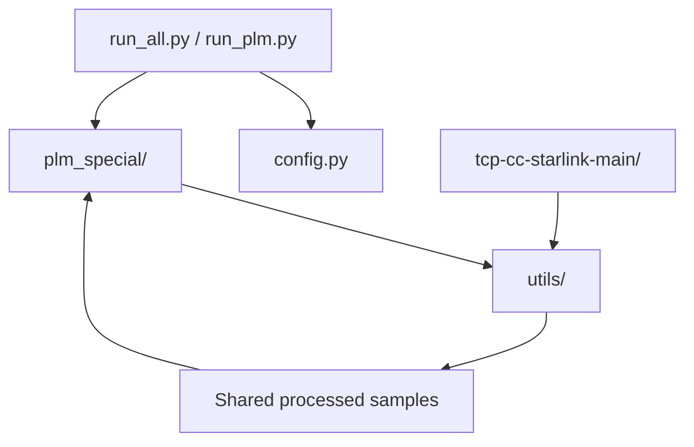

# Quantum-Enhanced GPT for BBR over Starlink

> Architecture, research contract, and coding rules for human contributors and AI coding agents.

## 1. Project objective

This project extends the **Small Language Model-based Control for BBR over Low Earth Orbit Satellite Internet** framework.

**Scope was simplified on 2026-09-03** (user + tutor decision, to keep the
study small and unambiguous): the research contribution is now exactly one
comparison —

1. attach a trainable Qiskit VQC action head to one fixed SLM (`LFM2.5-350M`);
2. compare it (`gpt_quantum`) against the same SLM with its normal classical head (`gpt_classical`).

Comparing against `classical_twin` (a parameter-matched classical bottleneck)
and against modern downloadable LMs or the original paper's four SLMs is
**out of scope** for this comparison. That broader multi-model work still
exists (frozen, Tokyo-evaluated) and is preserved under `archive/` as
historical context/justification for the backbone choice — it is not part of
the current research question.

The project does **not** redesign BBR, create a new channel-allocation problem, or replace the original task with generic classification.

### Primary research question

> Does attaching a Qiskit VQC action head to one SLM change its BBR pacing-gain prediction ability, compared with the same SLM's classical head?

### Primary hypothesis

Under an otherwise identical pipeline, a trainable quantum component can change the accuracy-efficiency-generalisation trade-off of a GPT-based BBR controller.

This is a hypothesis to test, not an expected result. Code and reports must not assume that the quantum model wins.

## 2. Source of truth and evidence hierarchy

When instructions conflict, follow this order:

1. written direction from the tutor/supervisor;
2. this research contract;
3. the original SLM-BBR paper and its released code/data;
4. experiment configuration files committed to this repository;
5. implementation convenience.

Core references:

- `upstream/main` commit `c0afba6521e62c09d4f558095fb83e577a1f7c80`: verified official SLM-BBR source-code snapshot cited by the paper;
- `project_sources/2607.07142v1 copy.pdf`: original SLM-BBR task, State Encoder, Low-Rank Adaptation, constrained networking head, action space, split, and evaluation;
- `project_sources/2607.07133v1 copy.pdf`: BBR-v3/Starlink experimental motivation and network measurements;
- `project_sources/TMC_Congestion_Control_Comparison_in_Starlink copy.pdf`: supporting BBR/Starlink comparison;
- `project_sources/Quantum_Reinforcement_Learning_With_Classical_Policy_Deployment_for_Resource_Allocation_in_Multibeam_GEOLEO_Satellite_Networks copy.pdf`: background on trainable variational quantum circuits, not the definition of this project's networking task;
- `project_sources/Distilling_Large_Language_Models_for_Network_Active_Queue_Management copy.pdf`: related language-model network control and efficient adaptation;
- `project_sources/1-s2.0-S1389128624005036-main copy.pdf`: systems background for pluggable ML-based congestion control.

Do not cite the quantum resource-allocation paper as if it required quantum integration in the SLM-BBR paper. Quantum integration is the new contribution of this project.

### 2.1 Canonical paper terminology and naming boundary

Use the scientific names from the main paper in documentation, manifests,
figures, tables, and new experiment descriptions. In particular:

| Canonical paper term | Existing code alias allowed for compatibility |
|---|---|
| `Small Language Model (SLM)` | `PLM` only where an existing identifier or CLI requires it |
| `State Encoder` | `state_encoder`, `EncoderNetwork` |
| `Low-Rank Adaptation (LoRA)` | `low_rank`, `peft_model` |
| `Offline RL Policy with Language Model Head` | `OfflineRLPolicy` |
| `networking head` | `action_head` or `classical` only as existing code/config identifiers |
| `ProbeBW_UP` | `BW_UP` |
| `ProbeBW_DOWN` | `BW_DOWN` |
| `ProbeBW_CRUISE` | `BW_CRUISE` |
| `GPT-2`, `T5`, `GPT-Neo`, `SmolLM2` | machine-safe IDs may be added, but the displayed model names stay unchanged |

An agent must not invent a replacement scientific name when starting a new
direction. A new experiment ID may append a neutral qualifier for traceability,
but it must retain the canonical method/model term and must not imply an
unverified result. Existing public code identifiers must not be renamed merely
for style; any identifier migration requires an explicit compatibility plan and
human approval.

The authority for a name is, in order: the main paper's displayed term, an
existing public identifier in the verified upstream/current code, then an
approved ADR. Agents must search these sources before adding a model role,
method, head, metric, dataset, experiment, or figure name. Descriptive aliases
such as “smart head”, “enhanced winner”, or a newly coined method acronym are
prohibited unless the user explicitly approves the scientific naming change in
an ADR. Neutral run-directory suffixes such as seed, rank, epoch, `smoke`,
`pilot`, or `preflight` are allowed and do not become paper terminology.

The words `exact`, `same as the paper`, and `paper reproduction` are controlled
claims. They may be used only when the exact model/checkpoint revision, released
preprocessing and Experience Pool, action constraints, State Encoder, LoRA
configuration, sequence construction, mini-batch/effective-batch definition,
optimizer and schedule, 150-epoch budget, gradient clipping, checkpoint rule,
and evaluation split have all been verified and recorded. Otherwise describe
the work factually as a partial reproduction or a modern-backbone extension;
do not rename the underlying paper method.

## 3. Research invariants

The following are locked unless the tutor explicitly approves a methodological change.

### 3.1 Task

- Input: structured sequences derived from real Starlink BBR/iperf3 telemetry.
- State fields: location flag, stream flag, time, throughput, retransmissions, congestion window, receiver window, RTT, and RTT variance.
- Output: exactly one valid BBR pacing-gain action per prediction position.
- Objective: learn the offline return-conditioned BBR policy described in the source paper.
- Loss: cross-entropy over the valid action labels, following Eq. (20) of the source paper.

### 3.2 Action space and safety constraint

The global action space is fixed:

```python
PACING_GAINS = [0.90, 0.92, 0.94, 0.96, 0.98, 1.00,
                1.05, 1.10, 1.15, 1.20, 1.25]
```

The feasible action set is phase-constrained:

| BBR macro-phase | Permitted gains |
|---|---|
| `BW_DOWN` | `0.90, 0.92, 0.94, 0.96, 0.98` |
| `BW_CRUISE` | `1.00` |
| `BW_UP` | `1.05, 1.10, 1.15, 1.20, 1.25` |

Invalid logits must be masked before action selection. Do not change this into a 12-class task, continuous-action task, text-generation task, or unconstrained classifier.

### 3.3 Data split

- Training/validation locations: Ohio, Sao Paulo, London, Mumbai, and Sydney.
- Held-out generalisation test: Tokyo.
- No Tokyo-derived examples, statistics, thresholds, fitted scalers, checkpoints, or hyperparameter decisions may leak into training.
- Any validation split must be derived only from the five training locations and recorded in configuration.

### 3.4 Reward and labels

- Preserve the source paper's phase detection, reward construction, rolling references, and expert-label generation.
- Preserve the documented constants unless running a separately named sensitivity study: `w=10`, `kappa=0.7`, `lambda_1=0.5`, `lambda_2=0.1`, `alpha=1.5`, `beta=5`, `epsilon=1e-3`, and `kappa_down=0.5`.
- Never regenerate labels differently for one model family.
- Dataset generation must be deterministic, versioned, and shared by every model.

### 3.5 Fair-comparison rule

All headline models must use the same:

- dataset version and split;
- feature/state representation;
- return and action construction;
- sequence-sampling policy;
- action mask;
- metric implementation;
- evaluation records;
- random-seed set;
- stopping/checkpoint-selection rule.

Model-specific token dimensions, tokenizer details, LoRA target modules, and memory-safe batch sizes may differ when required by architecture. Every difference must be declared in the experiment manifest; effective batch size and optimisation budget must remain comparable.

### 3.6 Tokyo lifecycle and post-Tokyo decisions

Tokyo is a one-way evaluation gate:

```text
freeze development protocol and checkpoints
  -> generate/verify held-out Tokyo pool
  -> inference only
  -> report without tuning
```

Creating the Tokyo pool counts as opening its preprocessing data, even before
model inference. After that point, Tokyo phase counts, labels, predictions,
losses, network surrogates, or rankings must not influence model selection,
Quantum-GPT parent selection, head design, hyperparameters, epoch choice, seed
policy, or retry policy. A design chosen after inspecting Tokyo outcomes is an
exploratory post-hoc study and cannot be presented as pristine held-out
generalisation.

The current approved location encoding is development flags 0-4 and Tokyo flag
5. All evaluated models must use that same frozen representation.

## 4. System architecture



### 4.1 Shared pipeline

```text
raw telemetry
  -> deterministic preprocessing
  -> phase-safe expert labels
  -> state/action/return sequences
  -> model backbone
  -> task head
  -> phase mask
  -> pacing-gain action
  -> shared evaluation
```

Preprocessing, dataset construction, action masking, and evaluation must be model-agnostic modules. A model implementation must not contain its own private version of these operations.

### 4.2 Required model groups (current simplified scope)

| ID | Model | Purpose | Required for primary claim |
|---|---|---|---|
| `gpt_classical` | `LFM2.5-350M` + classical head | Isolates the SLM baseline | Yes |
| `gpt_quantum` | Same `LFM2.5-350M` + quantum component | Proposed model | Yes |

The classical and quantum variants must use the **same checkpoint, hidden-state extraction point, input pipeline, train/evaluation split, and tuning policy**. Otherwise, the effect of quantum integration is confounded.

`gpt_classical_twin` (parameter-budget-matched classical bottleneck),
`modern_<name>` (other downloadable LM backbones), and `paper_<name>`
(GPT-2/T5/GPT-Neo/SmolLM2) are **not required** for the current comparison —
dropped on 2026-09-03 to keep the study to one question. Prior work in those
groups is preserved under `archive/` and may inform discussion, but is not
part of the primary claim.

### 4.3 Default quantum integration

Until an alternative is approved and recorded in an Architecture Decision Record (ADR), use a hybrid quantum-classical head:

```text
GPT hidden state at action position
  -> trainable projection d_model -> n_qubits
  -> bounded angle scaling
  -> Qiskit variational quantum circuit
  -> Pauli-Z expectation values
  -> trainable projection n_qubits -> 11 logits
  -> phase-safe mask
```

Initial research configuration:

- 4 qubits;
- angle encoding;
- 2 variational layers;
- trainable single-qubit rotations;
- ring entanglement;
- Pauli-Z expectation measurements;
- Qiskit Machine Learning `EstimatorQNN` connected to PyTorch with `TorchConnector`;
- Qiskit local `StatevectorEstimator` for analytic simulation during initial development;
- end-to-end gradients through the projection, VQC, output head, and approved LoRA parameters.

These values are **experiment defaults**, not immutable truths. Changing qubit count, circuit depth, encoding, ansatz, measurement, shot count, or moving away from the Qiskit backend requires a named ablation or ADR. Never silently tune the VQC using Tokyo results.

### 4.4 Classical twin

The parameter-budget-matched control should follow the same bottleneck path without quantum operations:

```text
GPT hidden state
  -> Linear(d_model, n_qubits)
  -> nonlinearity
  -> Linear(n_qubits, 11)
  -> phase-safe mask
```

Report exact trainable parameter counts. If exact matching is impossible, report the difference and keep it as small as practical.

### 4.5 Backbone eligibility

A backbone used for trainable quantum integration must:

- have downloadable/open weights and a licence compatible with the research;
- expose hidden states in the local framework;
- support gradient-based training of the attached module;
- run within the declared compute budget;
- use a pinned model ID and revision/commit hash.

API-only models may be reported as separate external baselines, but must not be described as having an internal, end-to-end-trained quantum layer. They are excluded from the primary architectural comparison unless the tutor explicitly changes the scope.

The exact GPT checkpoint and modern baselines belong in `configs/models.yaml` and an ADR. Do not hard-code an unconfirmed model choice throughout the codebase.

## 5. Evaluation contract

### 5.1 Primary outcomes

- action accuracy on the held-out Tokyo set;
- cross-entropy loss;
- surrogate throughput;
- surrogate retransmissions;
- inference/action-generation latency.

### 5.2 Efficiency and reproducibility outcomes

- total and trainable parameters;
- peak VRAM and host-memory use;
- training time and inference time;
- quantum circuit evaluations and shot count, when applicable;
- mean, standard deviation, and per-seed results over the same seed set.

### 5.3 Required comparison (current simplified scope)

At minimum:

1. `gpt_classical` — `LFM2.5-350M` with its normal classical head;
2. `gpt_quantum` — the same `LFM2.5-350M` with the VQC head.

The classical-bottleneck twin, a systematic qubit/depth sensitivity sweep, and
modern-baseline comparisons are optional follow-on work, not required for
this comparison (dropped 2026-09-03 to keep scope small). Because there is no
`classical_twin` control here, do not claim the quantum head's effect is
specifically "quantum" versus simply "a smaller bottleneck" — report the
observed difference between `gpt_classical` and `gpt_quantum` as-is, and name
this limitation explicitly in any write-up.

Do not claim quantum advantage from a single seed or training accuracy alone.

### 5.4 Published-reference rows

The user elected to use the paper's GPT-2, T5, GPT-Neo, and SmolLM2 results
directly rather than retrain those four models. These rows must be labelled
`published_reference` and visually separated from repository-measured rows.
They do not share this repository's sample-ID hash, epoch budget, hardware, or
runtime environment. Do not compute same-sample deltas, statistical tests, or
action-accuracy comparisons where the paper does not publish the underlying
number. Figure-only throughput/retransmission values remain plot-only unless a
separately documented digitization procedure reports them as estimates.

### 5.5 Current experiment sequence (simplified scope)

1. **Done.** Select `LFM2.5-350M` as the parent from four under-400M
   candidates using development-only validation metrics (ADR-0017).
2. **Done.** Train and Tokyo-evaluate `gpt_classical` (`LFM2.5-350M`,
   classical head): frozen, epoch 16, Tokyo accuracy 0.9575.
3. **In progress.** Train `gpt_quantum` (same backbone, Qiskit VQC head; 4
   qubits/depth 1, chosen from wall-clock benchmarking, not Tokyo) on the same
   five locations; validate on the same development holdout; freeze the
   checkpoint.
4. Evaluate `gpt_quantum` on Tokyo once frozen.
5. Report `gpt_classical` vs `gpt_quantum` side by side (accuracy, macro-phase
   accuracy, per-phase accuracy, latency, Tokyo throughput/retransmission box
   plots). Name the missing `classical_twin` control as a stated limitation.

The four-model modern-backbone-vs-paper sequence that used to occupy this
section is preserved under `archive/docs/adr/` (ADR-0001–0012, ADR-0016) and
`archive/docs/` for provenance; it is not part of the current sequence.

The current `gpt_quantum` training command and configuration are recorded in
`docs/CONTEXT.md` and `docs/adr/ADR-0017-under400m-quantum-gpt-parent-and-protocol-freeze.md`.
`archive/docs/LARGE_MODEL_TRAINING.md` documents the earlier large-backbone
operations guide and is historical only.

## 6. Current repository architecture

The repository currently uses this top-level layout:

```text
lm-bbr-starlink/
|-- .venv/                   # local environment; never commit or import as source
|-- plm_special/             # project-specific LM and Quantum-GPT development
|-- tcp-cc-starlink-main/    # downloaded upstream Starlink data/code baseline
|-- utils/                   # shared, model-independent helpers
|-- .gitignore
|-- config.py                # central runtime and experiment configuration
|-- run_all.py               # orchestrates comparable multi-model experiments
|-- run_plm.py               # runs one PLM/GPT experiment or smoke test
`-- ARCHITECTURE.md          # research scope and AI coding contract
```

This is the authoritative layout until a deliberate refactor is approved. Folder names alone do not prove their internal APIs: an agent must inspect the relevant files before importing, moving, or rewriting them.

### 6.1 Responsibility map

| Path | Owned responsibility | Must not become |
|---|---|---|
| `plm_special/` | GPT adapters, classical comparison head, VQC integration, training adapters, and model-specific tests | A second private data pipeline, split implementation, or metric implementation |
| `tcp-cc-starlink-main/` | Upstream dataset/code provenance and reproducibility reference | A folder where project-specific experiments silently modify upstream files |
| `utils/` | Shared parsing, seeding, logging, manifests, masks, metrics, and other model-independent helpers | A dumping ground for model-specific forward passes or hidden global state |
| `config.py` | Resolved paths, model IDs, revisions, split rules, seeds, hyperparameters, and quantum settings | A place for secrets, result-dependent tuning, or unrecorded machine-specific paths |
| `run_plm.py` | Thin entry point for a selected model/config; smoke tests and single runs | The implementation of preprocessing, model architecture, or metrics |
| `run_all.py` | Thin orchestration layer that launches fair, config-matched comparisons | A script that gives different data, metrics, or selection rules to different models |

### 6.2 Dependency direction



Allowed dependency rules:

- Entry points may depend on configuration, shared utilities, and model modules.
- `plm_special/` may depend on `utils/`, but shared utilities must not depend on a concrete GPT or quantum implementation.
- Project code may read upstream data/code through an explicit adapter. Upstream code must not import `plm_special/`.
- A runner must call reusable functions; research logic must remain importable and testable without executing a runner.
- Avoid circular imports and import-time training, downloads, dataset mutation, or environment changes.

### 6.3 Data placement

When the Starlink dataset is downloaded, preserve its original hierarchy and raw files. Prefer this placement if it does not conflict with the upstream repository:

```text
data/
|-- raw/
|   `-- tcp-cc-starlink-main/    # immutable downloaded content
|-- processed/                   # deterministic generated samples
|-- splits/                      # versioned sample IDs and location split
`-- manifests/                   # source URL, checksum, date, and schema
```

If the downloaded dataset already lives inside `tcp-cc-starlink-main/`, do not move it merely to match this document. Configure its path in `config.py`, keep raw files immutable, and write derived outputs outside the upstream tree. Raw/processed data, checkpoints, caches, and local environments must be excluded by `.gitignore`; manifests and small split definitions should be committed.

Do not assume that raw logs already contain the 11 training labels. Verify their schema and reproduce label construction from the paper/released code before implementing training.

### 6.4 Target internal boundaries

As functionality grows, prefer the following internal separation while keeping the existing top-level folders:

```text
plm_special/
|-- backbones.py             # pinned downloadable model adapters
|-- classical_head.py        # normal head and classical bottleneck twin
|-- quantum_head.py          # projection, VQC, measurement, output projection
|-- model.py                 # common [..., 11] model interface
|-- training.py              # shared model training integration
`-- registry.py              # model role -> constructor

utils/
|-- data.py                  # raw parsing and deterministic sample creation
|-- splits.py                # five train locations; Tokyo holdout guard
|-- bbr.py                   # gains, phases, action masks, reward/labels
|-- metrics.py               # one implementation shared by every model
|-- manifests.py             # resolved run metadata and provenance
`-- reproducibility.py       # seeds and deterministic settings
```

These filenames are a target boundary, not permission to overwrite existing modules. First map current files to these responsibilities; refactor only when required by the next experiment and keep imports backward-compatible where practical.

### 6.5 Execution contracts

`run_plm.py` should resolve one configuration and execute one declared model role:

```text
load config -> validate invariants -> load shared split -> build model
-> train/evaluate -> save manifest and metrics
```

`run_all.py` should enumerate configs and delegate to the same single-run function. It must not contain a separate implementation path. A failure in one model must be logged and surfaced, not silently skipped or replaced.

Every runner should support, at minimum, a quick smoke-test mode that uses only training-location samples. Smoke tests must never redefine the final split or be reported as research results.

## 7. Future repository boundaries (optional refactor)

```text
.
|-- ARCHITECTURE.md
|-- README.md
|-- configs/
|   |-- data.yaml
|   |-- experiment.yaml
|   `-- models.yaml
|-- data/
|   |-- raw/                 # immutable; never committed if restricted
|   |-- interim/
|   `-- processed/
|-- src/
|   |-- data/                # parsing, splits, labels, sequences
|   |-- bbr/                 # action space, phase mask, reward
|   |-- models/
|   |   |-- backbones.py
|   |   |-- classical_head.py
|   |   |-- quantum_head.py
|   |   `-- registry.py
|   |-- training/            # shared trainer, losses, checkpoints
|   |-- evaluation/          # shared metrics and surrogate models
|   `-- utils/               # seeds, logging, manifests
|-- tests/
|   |-- test_action_space.py
|   |-- test_phase_mask.py
|   |-- test_split_leakage.py
|   |-- test_shared_samples.py
|   `-- test_model_shapes.py
|-- experiments/             # immutable run manifests/results
|-- reports/
`-- docs/adr/                # research/architecture decisions
```

This future `src/` layout is optional. The current layout above is valid. Do not restructure the repository merely to match this example; adopt it only through a documented refactor that preserves behaviour and tests.

## 8. Experiment manifest

Every run must save, at minimum:

```yaml
run_id: null
git_commit: null
dataset_version: null
split_version: null
model_id: null
model_revision: null
model_role: gpt_classical | gpt_classical_twin | gpt_quantum | modern_baseline
head_type: classical | classical_twin | quantum
seed: null
sequence_length: null
effective_batch_size: null
epochs: null
optimizer: null
learning_rate: null
lora_config: null
quantum_config: null
checkpoint_rule: null
hardware: null
software_versions: null
```

Results without a manifest are exploratory only and must not enter headline tables.

## 9. Rules for AI coding agents

These rules are mandatory for any AI that reads, writes, reviews, or runs code in this project.

### 9.0 Non-negotiable agent contract

A new agent must first read, in order: `README.md`, this file,
`docs/CONTEXT.md`, `docs/SKILL.md`, and `docs/adr/ADR-0017-under400m-quantum-gpt-parent-and-protocol-freeze.md`;
then the applicable ADR, affected source/tests, and current git diff.
`archive/` holds an earlier, broader-scope direction for provenance only. For
manuscript work it must additionally read `archive/docs/PAPER_DRAFT.md` (the
earlier draft) and every manifest/reference supporting the edited claim.
Conversation summaries are navigation aids, not research authority.

Before changing code, every agent must be able to complete this sentence:

> This change supports **[shared BBR pipeline / GPT classical control / GPT classical twin / Quantum-GPT / modern baseline / evaluation]** and does not alter **the 11-action task, phase mask, shared data split, shared labels, or held-out Tokyo protocol**.

If the sentence cannot be completed truthfully, the agent must not implement the change.

Classify every requested task before editing:

| Task class | Examples | Agent action |
|---|---|---|
| `IMPLEMENTATION_ONLY` | Refactor, bug fix, logging, test, speed/memory improvement with identical outputs | May proceed after inspecting current behaviour and tests |
| `EXPERIMENT_VARIABLE` | Model checkpoint, LoRA target, qubits, circuit depth, learning rate | May proceed only through configuration and a clearly named experiment/ablation |
| `RESEARCH_INVARIANT` | Dataset split, labels, reward, action count/order, phase mask, primary metrics | Stop and obtain explicit tutor/human approval |
| `OUT_OF_SCOPE` | A2C/DDPG channel allocation, generic chatbot, unrelated quantum task | Reject or ask for the task to be reframed within this project |

An agent must never disguise a research-invariant change as a refactor, cleanup, compatibility fix, or optimisation.

### 9.1 Before coding

1. Read this entire file.
2. State which research question and model group the change supports.
3. Inspect the existing code, configs, tests, and current git diff before editing.
4. Identify whether the request changes an invariant, an experiment variable, or implementation only.
5. If an invariant would change, stop and request explicit human/tutor approval. Do not infer approval.

### 9.2 While coding

- Make the smallest change that satisfies the requested experiment.
- Reuse the shared dataset, split, masking, loss, and metric code.
- Keep model-specific logic inside model adapters/heads.
- Make every experimental choice configurable and log its resolved value.
- Pin external model identifiers and revisions; never use a floating `latest` revision in final experiments.
- Preserve tensor meaning and document shapes at module boundaries.
- Add or update tests for every changed invariant or interface.
- Maintain deterministic seeds where supported and record nondeterministic operations.
- Preserve existing user changes and unrelated code.
- Use neutral names such as `quantum`, `classical`, and `baseline`; do not encode expected superiority into variable names.
- Keep the shared path shared: preprocessing, split logic, labels, masks, loss, and evaluation must have one authoritative implementation used by every model.
- Keep the comparison causal: the selected GPT classical and Quantum-GPT variants may differ only in the declared head/integration component for the primary quantum comparison.
- Prefer explicit failure over fallback. Missing data, unavailable checkpoints, incompatible tensor shapes, and failed quantum execution must raise a clear error rather than silently selecting another model, dataset, or classical path.
- Treat smoke-test shortcuts as development-only. Mark their outputs clearly and prevent them from entering final result tables.

### 9.2.1 Allowed change matrix

| Area | Allowed without scope approval | Requires explicit approval |
|---|---|---|
| Data | Parser fixes that preserve sample meaning; deterministic caching; manifests | Adding/removing locations; using Tokyo during development decisions; changing label generation |
| BBR task | Tests and bug fixes that restore documented behaviour | Changing gains, action indices, phases, reward, or mask rules |
| GPT model | Adapter, hidden-state extraction, LoRA support, pinned checkpoint config | Using different GPT backbones for classical and quantum primary controls |
| Quantum | Implementing configured projection/VQC/output head; named ablations | Moving quantum to a different insertion point for the headline model without an ADR |
| Baselines | Adding downloadable modern models through the shared interface | Giving a baseline different data, labels, metrics, or checkpoint-selection access |
| Evaluation | New diagnostics that do not replace primary metrics | Replacing primary outcomes or selecting checkpoints with Tokyo results |
| Repository | Focused modules, tests, docs, backward-compatible refactors | Broad restructuring unrelated to the next research milestone |

### 9.3 Prohibited changes

An AI agent must not, without explicit approval:

- change the research task to channel allocation, A2C, DDPG, generic text generation, or a different networking problem;
- introduce a 12th action, reorder action indices, or remove the BBR phase mask;
- train on Tokyo or fit preprocessing statistics using Tokyo;
- change reward/label construction for only one model;
- compare models on different samples and present the result as fair;
- replace the selected GPT checkpoint between its classical and quantum variants;
- call an external API inside the primary training loop;
- describe an API post-processor as quantum integrated inside GPT;
- tune hyperparameters against the held-out Tokyo test set;
- delete failed runs, hide seeds, cherry-pick only favourable results, or claim quantum advantage without statistical evidence;
- silently substitute synthetic data when real data is missing;
- hard-code secrets, tokens, local absolute paths, or private dataset locations;
- invent paper requirements, citations, results, or tutor decisions;
- invent scientific names, abbreviations, model roles, method labels, or rename
  a paper/codebase term merely for style;
- choose the Quantum-GPT parent or head from Tokyo performance;
- combine paper-published values and repository-measured values as if they came
  from the same samples, epoch budget, or hardware;
- change the research scope merely to make implementation easier.

### 9.4 When uncertain

Stop and ask one focused question if any of these are unknown:

- exact GPT checkpoint;
- approved modern baseline list;
- quantum insertion point;
- available compute budget;
- whether a methodological change has tutor approval;
- whether the requested result is exploratory or eligible for the final report.

Record a confirmed decision in `docs/adr/ADR-XXXX-<decision>.md` and update the relevant config. Conversation history alone is not a durable experiment specification.

### 9.4.1 Mandatory stop conditions

Stop coding and ask for clarification when:

- the requested change conflicts with this file or a committed ADR;
- the exact model/checkpoint or expected tensor interface cannot be verified;
- completing the task requires altering raw data or upstream reference code;
- an apparent bug fix would change labels, split membership, action mapping, or reported metrics;
- the implementation would make the classical and quantum controls non-equivalent;
- a dependency or compute limitation would require silently reducing the scientific protocol;
- current code behaviour cannot be determined from source/tests and proceeding would require guessing.

Do not resolve these cases by inventing defaults. State the blocker, identify the affected invariant, and ask one focused question.

### 9.5 Required response after a code change

Every AI coding hand-off must report:

1. files changed;
2. research purpose supported;
3. invariants checked;
4. tests/commands run and their outcomes;
5. experiment/config impact;
6. unresolved assumptions or risks.

The hand-off must also include this scope check:

```text
Scope check: PASS | BLOCKED
Task class: IMPLEMENTATION_ONLY | EXPERIMENT_VARIABLE | RESEARCH_INVARIANT | OUT_OF_SCOPE
Data/split changed: yes/no
Labels/reward/actions changed: yes/no
Classical-vs-quantum comparability preserved: yes/no/not-applicable
Tokyo isolation verified: yes/no/not-applicable
```

`PASS` is permitted only when every relevant answer is verified from code, configuration, or tests—not assumed.

## 10. Automated guardrails

CI should fail when:

- action count is not 11;
- action-index-to-gain mapping changes unexpectedly;
- a phase permits an invalid gain;
- Tokyo appears in training or fitted preprocessing inputs;
- two headline models receive different evaluation sample IDs;
- a run lacks model revision, dataset version, seed, or resolved configuration;
- output logits do not have shape `[..., 11]`;
- NaN/Inf values appear in classical or quantum forward/backward passes.

Golden tests should compare a small fixed dataset through all model adapters to confirm identical sample order, labels, masks, and metric inputs.

## 11. Decision log and unresolved items

- [x] Backbone for both `gpt_classical` and `gpt_quantum`: `LFM2.5-350M` (ADR-0017, development-only evidence).
- [x] Under-400M modern baseline set and revisions frozen for the 16-epoch Tokyo extension (out of current scope, kept for provenance in `archive/`).
- [x] Quantum insertion point: action-position hidden state.
- [x] Qubit count, circuit depth: 4 qubits, depth 1, `trainable_ry_layers`, chosen by wall-clock benchmark (~13-15x faster than 8 qubits/depth 2) — see `docs/CONTEXT.md`.
- [x] Qiskit backend: local `StatevectorEstimator`, analytic, no finite shots.
- [x] LoRA: rank 128, alpha 32, dropout 0.05, same target modules as `gpt_classical` (only the head differs).
- [x] Seed: `100003`. Single-seed only — a stated limitation, not resolved.
- [x] Validation protocol: frozen development holdout, same as `gpt_classical`.
- [ ] Whether final evaluation remains surrogate-only or includes TCP-in-the-loop tests.

The Tokyo pool was generated on 2026-09-03 with approved location flag 5.
`gpt_classical` has a Tokyo result. `gpt_quantum`'s circuit was chosen from a
training-data wall-clock benchmark only — no Tokyo evidence was used.

### 11.1 Paper-writing evidence contract

Every manuscript statement must be traceable to exactly one evidence class:

- `published_reference`: the main paper, identified by section/table/figure/equation;
- `measured_exploratory`: a local manifest marked non-reportable;
- `measured_final`: a frozen run/evaluation manifest eligible for reporting;
- `interpretation`: an explicitly identified inference supported by cited evidence.

Do not turn missing values into zeros, infer exact values from a plot without
labelling digitization, promote a smoke test to a result, hide failed seeds, or
write “same as the paper” when a backbone, epoch budget, preprocessing
assumption, or runtime differs. `archive/docs/PAPER_DRAFT.md` is a draft view
of the earlier, broader-scope evidence; manifests and source papers remain
authoritative.

Until these are confirmed, agents may build interfaces, tests, a small smoke-test model, and deterministic preprocessing. They must not present exploratory runs as final research results.

## 12. Definition of done

A result is ready for research reporting only when:

- all invariants and guardrail tests pass;
- the run is reproducible from a committed config and pinned revisions;
- the GPT classical, classical-twin, and quantum variants use identical eligible data and evaluation;
- all required baselines and seeds complete or failures are transparently documented;
- accuracy, network outcomes, latency, memory, and parameter counts are reported together;
- limitations distinguish simulator evidence from quantum-hardware evidence;
- claims match the recorded results and do not exceed them.

---

**One-sentence scope check:** This repository attaches a Qiskit VQC action head to one SLM (`LFM2.5-350M`) for the original 11-action SLM-BBR Starlink task and compares it fairly with the same SLM's classical head, without changing the underlying research problem.
